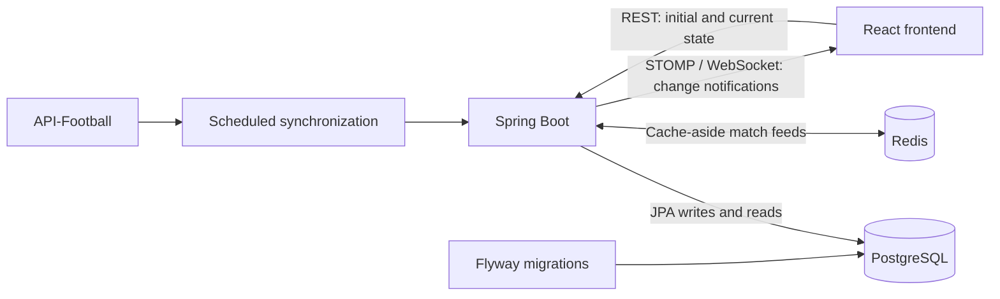
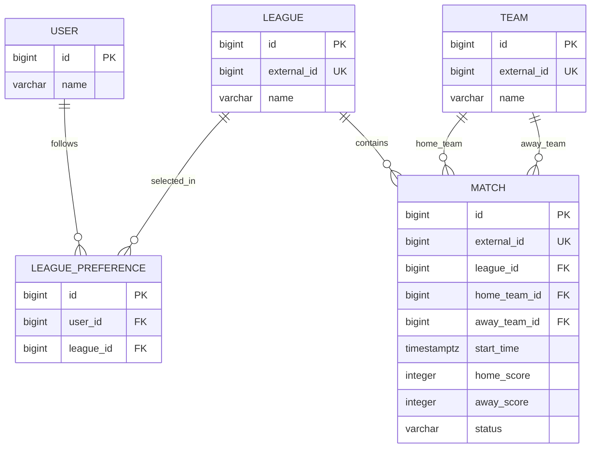

# Real-Time Soccer Platform

[](https://github.com/asab77/real-time-soccer-platform/actions/workflows/ci.yml)

A full-stack soccer match platform that combines scheduled provider synchronization, personalized match feeds, Redis caching, and live browser updates. The project uses a conventional Spring Boot service architecture with PostgreSQL as its source of truth and a React client for league preferences and match tracking.

## Demo / Screenshots

The application runs locally at `http://localhost:3000` after following the Docker Compose quick start below.

> Screenshot placeholder — dashboard and league-preference view.

## Architecture



PostgreSQL remains authoritative. REST returns the current application state; WebSocket messages notify connected clients that match state changed.

## Tech Stack

- **Frontend:** React, TypeScript, Vite
- **Backend:** Java 21, Spring Boot, Spring Data JPA, Spring Cache, Spring WebSocket/STOMP
- **Data:** PostgreSQL, Redis, Flyway
- **Infrastructure:** Docker, Docker Compose, nginx
- **External data:** API-Football
- **Testing:** Spring Boot test suite, Vitest and Testing Library

## Engineering Highlights

- REST APIs load initial state and provide authoritative league, preference, and match data.
- STOMP/WebSocket topics push score and status change notifications to interested clients.
- Match feeds use Redis with a cache-aside pattern while PostgreSQL remains the source of truth.
- Flyway owns versioned database migrations; Hibernate validates rather than mutates the schema.
- Provider fixture IDs make synchronization idempotent, updating existing fixtures instead of duplicating them.
- Cache invalidation and WebSocket publication occur after a successful transaction commit, so clients never observe rolled-back changes.
- Provider synchronization is centralized by league and date instead of making external calls per user.
- Redis failures degrade gracefully to PostgreSQL-backed reads.
- Docker Compose supplies a repeatable four-service local environment with health checks and persistent PostgreSQL storage.
- API credentials are supplied only through environment variables.

## Real-Time Data Flow

```text
API-Football
→ ScheduledFixtureSync
→ FixtureSyncService
→ PostgreSQL transaction
→ commit
→ Redis cache invalidation
→ WebSocket MatchUpdateMessage
→ React client
→ REST refetch of the active match filter
```

The WebSocket message is deliberately a change notification. After receiving it, the frontend refetches REST data so filtering and response construction stay centralized in the backend.

## Database Model



`LeaguePreference` enforces one preference per user/league pair. A match must reference different home and away teams.

## API Examples

| Method | Endpoint | Purpose |
| --- | --- | --- |
| `GET` | `/demo/user` | Retrieve the local demo user |
| `GET` | `/leagues` | List available leagues |
| `GET` | `/users/{userId}/preferences` | List a user's followed leagues |
| `POST` | `/users/{userId}/preferences` | Follow a league using `{"leagueId": 1}` |
| `DELETE` | `/users/{userId}/preferences/{leagueId}` | Unfollow a league |
| `GET` | `/users/{userId}/matches` | Retrieve a personalized match feed |
| `GET` | `/leagues/{leagueId}/matches` | Retrieve matches for one league |
| `POST` | `/internal/sync/fixtures` | Manually synchronize one provider league/date |

Match endpoints accept status filtering, for example:

```bash
curl "http://localhost:8080/users/1/matches?status=LIVE"
```

A manual synchronization consumes one provider request:

```bash
curl -X POST "http://localhost:8080/internal/sync/fixtures?externalLeagueId=39&season=2026&date=2026-09-06"
```

## Quick Start

Prerequisite: Docker Desktop or another Docker installation with Compose.

```bash
docker compose up --build
```

- Frontend: `http://localhost:3000`
- Backend: `http://localhost:8080`

Stop the stack while preserving PostgreSQL data:

```bash
docker compose down
```

Intentionally delete the local database volume and rebuild from Flyway:

```bash
docker compose down --volumes
docker compose up --build
```

The first command permanently removes the Compose-managed local database. Scheduled provider synchronization is disabled by default. To enable it, supply the provider key outside Git:

```bash
export API_FOOTBALL_KEY=<your-key>
export SOCCER_SYNC_ENABLED=true
docker compose up --build
```

Never place the real key in source files, Compose files, frontend configuration, or Git history.

## Environment Variables

| Variable | Default | Usage |
| --- | --- | --- |
| `API_FOOTBALL_KEY` | empty | Backend provider credential; required only for real synchronization |
| `SOCCER_SYNC_ENABLED` | `false` | Enables scheduled synchronization |
| `SOCCER_SYNC_INTERVAL` | `PT1H` | Delay between scheduled synchronization runs |
| `DB_HOST` | `localhost` | PostgreSQL host; Compose supplies `postgres` |
| `DB_PORT` | `5432` | PostgreSQL port |
| `DB_NAME` | `soccer_platform` | PostgreSQL database name |
| `DB_USER` | `postgres` | PostgreSQL username; Compose defaults to local user `soccer` |
| `DB_PASSWORD` | `postgres` | PostgreSQL password; override outside source control |
| `REDIS_HOST` | `localhost` | Redis host; Compose supplies `redis` |
| `REDIS_PORT` | `6379` | Redis port |
| `SPRING_DATA_REDIS_URL` | empty | Optional complete `redis://` or `rediss://` managed-store URL; overrides host/port |
| `MATCH_CACHE_TTL` | `45s` | Match-feed cache lifetime |
| `FRONTEND_ORIGIN` | `http://localhost:5173` | Backend REST and WebSocket CORS origin; Compose uses port 3000 |
| `VITE_API_BASE_URL` | `http://localhost:8080` | Backend URL embedded in the frontend build |
| `PORT` | `8080` | Backend HTTP port; Render supplies this automatically |

Docker Compose also supports host-port overrides such as `FRONTEND_PORT`, `BACKEND_PORT`, and `POSTGRES_PORT`. Local-only environment files matching `.env*` are ignored by Git.

## Testing

Backend tests use H2 and mocked provider behavior, so they require no PostgreSQL, Redis, Docker, provider key, or external request:

```bash
./mvnw test
```

Frontend tests and production build:

```bash
cd frontend
npm ci
npm test
npm run build
```

The current verified baseline is 43 backend tests and 7 frontend tests. GitHub Actions runs both suites on pushes to `main` and pull requests targeting `main`.

## Deployment

The intended Render architecture keeps the same application boundaries:

```text
Render Static Site (React)
→ Render Web Service (Spring Boot)
→ Render PostgreSQL
→ Render Key Value (Redis-compatible)
```

Use a **Render Static Site** for the frontend. It serves the Vite output through
Render's CDN without running an nginx container. Configure its root directory as
`frontend`, build command as `npm ci && npm run build`, and publish directory as
`dist`. Set `VITE_API_BASE_URL` to the backend's public HTTPS URL. If client-side
routes are added, configure a rewrite from `/*` to `/index.html`.

Use a **Docker Web Service** for the backend with the repository's root
`Dockerfile`. Configure `/actuator/health` as its health-check path. Render
supplies `PORT`; Spring defaults to 8080 elsewhere.

Configure these backend environment variable names in Render:

- `DB_HOST`, `DB_PORT`, `DB_NAME`, `DB_USER`, `DB_PASSWORD`
- `SPRING_DATA_REDIS_URL` using the managed Key Value internal URL
- `FRONTEND_ORIGIN` using the frontend's public HTTPS origin, without a trailing slash
- `API_FOOTBALL_KEY` as a secret only when live synchronization is needed
- `SOCCER_SYNC_ENABLED`, which remains `false` unless explicitly enabled
- Optional scheduler/cache tuning: `SOCCER_SYNC_INTERVAL`,
  `SOCCER_SYNC_INITIAL_DELAY`, `SOCCER_SYNC_START_UTC`, `SOCCER_SYNC_END_UTC`,
  and `MATCH_CACHE_TTL`

Place the backend, PostgreSQL, and Key Value services in the same Render region
and use their internal connection details. Flyway runs automatically before
Hibernate validates the schema. The API key belongs only in the backend
service's secret environment; never expose it to the frontend build.

No `render.yaml` is committed yet. The frontend and backend public URLs are
assigned during service creation, and database/Key Value plans and regions are
account choices. Creating these resources once in the dashboard avoids encoding
guessed plans or circular URL assumptions; a Blueprint can be added after those
deployment choices are known.

## MVP Tradeoffs

- Free-tier provider limits favor conservative scheduled synchronization rather than second-by-second polling.
- Spring's STOMP simple broker is suitable for this single-instance MVP, not horizontal scaling.
- Authentication is intentionally deferred; the local demo user makes the complete flow easy to evaluate.
- Cache invalidation is broad for clarity and correctness at the current scale.
- Live provider verification requires an externally supplied `API_FOOTBALL_KEY`.
